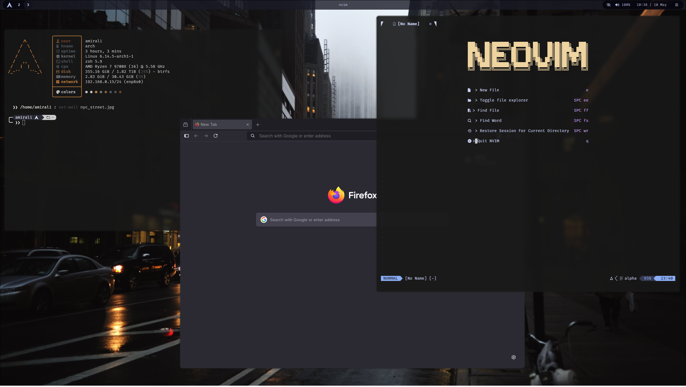
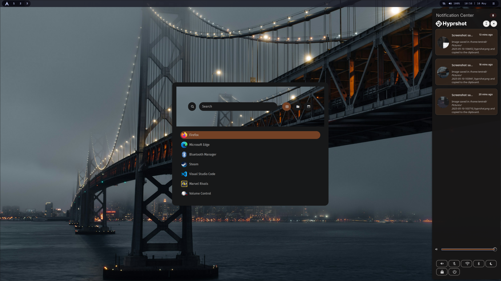
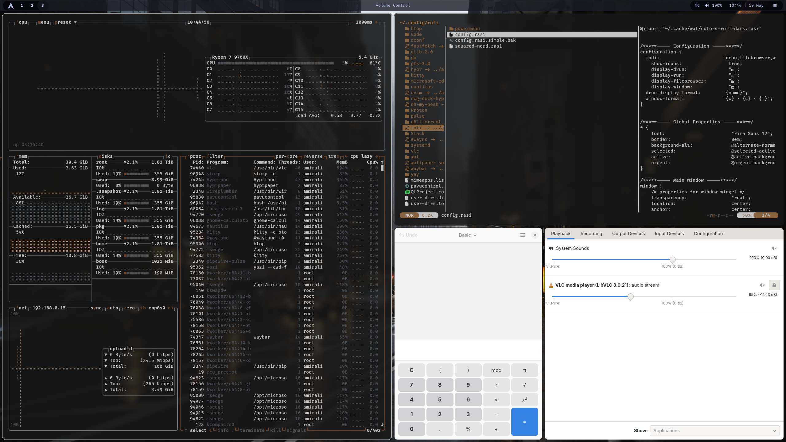

# Hyprland Setup

# Version 2
In this version I'm trying to have a simpler and more robust setup.

## To Do:
- Moving windows between two differently scaled monitors --> blur
- Scaling of Xorg apps like Edge & Code is off
- Enable Secure Boot
- Snapper
- Alt + Tab
- Idle (dim the screen etc.)
- No sleep mode (also got an icon for it in waybar)
- NeoVim

## Done:
- Rofi
- Power Menu
- Auto Login
- Wallpaper
- swaync Notification (its trying to import pywal colors and fails)
- Lock Screen
- Screenshot tool

## Upgrades:

These are not necessary but will make nice additions.

- Grub customization
- Waybar arch icon --> power menu / rofi
- Manage and unify all the fonts in the system (a font software with gui?)
